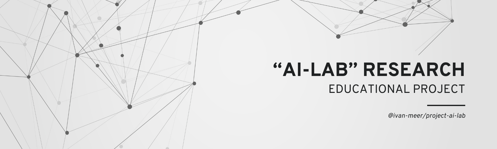

# 🧠 Swarm AI Management System

<div align="center">


[](https://www.python.org)
[](https://fastapi.tiangolo.com/)
[](https://reactjs.org/)
[](https://docs.pydantic.dev/)
[](https://lightning.ai/)
[](LICENSE)
[](/)

**An intuitive platform for managing, coordinating, and orchestrating multiple AI agents into a powerful swarm intelligence system**

[Русская версия](README.ru.md) • [Key Features](#key-features) • [Installation](#installation) • [Quick Start](#quick-start) • [Documentation](#documentation) • [Architecture](#architecture) • [License](#license)
</div>

## 🌟 Key Features![

<table>
  <tr>
    <td width="50%">
      <h3>🤖 Agent Management</h3>
      <ul
        <li>Create, configure, and manage specialized AI agents</li>
        <li>Real-time monitoring of agent status and performance</li>
        <li>Extensible agent templates for common roles</li>
      </ul>
    </td>
    <td width="50%">
      <h3>🔄 Dynamic Orchestration</h3>
      <ul>
        <li>Coordinate complex workflows across multiple agents</li>
        <li>Automatic task distribution and prioritization</li>
        <li>Intelligent error handling and recovery</li>
      </ul>
    </td>
  </tr>
  <tr>
    <td width="50%">
      <h3>📊 Visualization & Analysis</h3>
      <ul>
        <li>Interactive dashboards for system monitoring</li>
        <li>Performance metrics and analytics</li>
        <li>Process flow visualization</li>
      </ul>
    </td>
    <td width="50%">
      <h3>⚙️ Extensible Architecture</h3>
      <ul>
        <li>Modular design for easy customization</li>
        <li>RESTful API for seamless integration</li>
        <li>Well-documented codebase with Pydantic models</li>
      </ul>
    </td>
  </tr>
</table>

## 📸 Screenshots


<div align="center">
  
  <p><em>Main dashboard showing agent status and system performance</em></p>
</div>

<div align="center">
  <table>
    <tr>
      <td></td>
      <td></td>
    </tr>
    <tr>
      <td align="center"><em>Agent Management Interface</em></td>
      <td align="center"><em>Process Visualization and Monitoring</em></td>
    </tr>
  </table>
</div>

## 🚀 Installation

### Prerequisites

- Python 3.10+
- Node.js 16+
- npm or yarn
- Lightning.ai account

### Backend Setup

```bash
# Clone the repository
git clone https://github.com/yourusername/swarm-ai-system.git
cd swarm-ai-system

# Set up a virtual environment
python -m venv venv
source venv/bin/activate  # On Windows: venv\Scripts\activate

# Install backend dependencies
pip install -r requirements.txt

# Initialize the database
python -m scripts.init_db
```

### Frontend Setup

```bash
# Navigate to frontend directory
cd frontend

# Install dependencies
npm install

# Build production files
npm run build
```

## ⚡ Quick Start

### Start the Server

```bash
# From the project root
python main.py
```

Visit `http://localhost:8000` to access the web interface.

### API Documentation

FastAPI automatically generates interactive API documentation:

- Swagger UI: `http://localhost:8000/api/docs`
- ReDoc: `http://localhost:8000/api/redoc`

## 🧩 System Architecture

### System Components Diagram


> **Diagram Explanation:** 
> 
> This architectural diagram illustrates the complete system structure of our Swarm AI platform. The system consists of three major layers:
> 
> 1. **Frontend Layer**: A React-based user interface that provides different functional modules including a monitoring dashboard, agent management, task management, process orchestration, and analytics visualization.
> 
> 2. **Backend Layer**: Built on FastAPI, this layer contains the core business logic, including an API gateway for client communication, service layer for business logic, orchestration engine for agent coordination, and database interactions.
> 
> 3. **Lightning.ai Integration**: The system leverages Lightning.ai platform for powerful machine learning capabilities, providing LLM services, auto-scaling resources, and monitoring tools.
> 
> The central component is the Agent System which houses the Agent Registry (for managing available agent types), Runtime Environment (where agents execute their tasks), and Message System (facilitating communication between agents). All these components work together to create a coherent and robust swarm intelligence system that can solve complex problems through agent collaboration.
>
> For in-depth explanation, see the [Architecture Guide](docs/architecture/system_architecture.md)

### Agent Lifecycle


> **Diagram Explanation:**
> 
> This state diagram depicts the complete lifecycle of an AI agent within our swarm system:
> 
> 1. **Creation Phase**: The agent is initialized with its base configuration and enters the Created state.
> 
> 2. **Preparation Phase**: The agent loads all necessary parameters, models, and tools, then enters the Ready state, waiting for tasks.
> 
> 3. **Active Phase**: When assigned a task, the agent transitions to the Active state, then to Busy when executing.
> 
> 4. **Interaction Phase**: During task execution, the agent may need to request information (Waiting state) from other agents or external sources.
> 
> 5. **Completion Phase**: After task completion, the agent returns to Active state, then Ready when released from the task.
> 
> 6. **Error Handling**: If failures occur, the agent enters the Error state and attempts recovery procedures.
> 
> 7. **Control States**: Administrators can Pause and Resume agents as needed for system maintenance.
> 
> 8. **Termination**: When no longer needed, agents are Stopped and eventually unloaded from the system.
> 
> Understanding this lifecycle is crucial for effective agent management and troubleshooting. Each transition triggers specific events and logging in the system.
> 
> For implementation details, see the [Agent Lifecycle Documentation](docs/agents/agent_lifecycle.md)

### Task Processing Sequence


> **Diagram Explanation:**
> 
> This sequence diagram illustrates the end-to-end flow of a task through our swarm intelligence system:
> 
> 1. **Task Creation**: The client submits a task through the API Gateway, which saves it to the database and notifies the Orchestrator.
> 
> 2. **Task Analysis & Planning**: The Orchestrator analyzes the task and develops an execution strategy, breaking it down into subtasks.
> 
> 3. **Agent Assignment & Execution**: Subtasks are assigned to specialized agents (AgentA, AgentB, AgentC) based on their capabilities and current workload.
> 
> 4. **Progressive Processing**: Each agent processes its assigned subtask, updates its status in the database, and returns results to the Orchestrator.
> 
> 5. **Coordination & Dependency Management**: The Orchestrator coordinates the sequence of agent activities, ensuring that agents receive necessary inputs from preceding operations.
> 
> 6. **Result Compilation**: After all subtasks are completed, the Orchestrator compiles the final result, saves it to the database, and returns it to the client.
> 
> This workflow demonstrates the system's ability to decompose complex problems into manageable subtasks, distribute them to specialized agents, and reassemble the results into a coherent solution.
> 
> For practical implementation examples, see the [Task Processing Tutorial](docs/tutorials/task_processing.md)

### Educational Learning Path

```mermaid
graph LR
    A[AI Fundamentals] --> B[LLM Concepts]
    B --> C[Agent Methodology]
    C --> D[Swarm Intelligence]
    D --> E[Platform Practice]
    
    subgraph Theoretical Foundation
        A
        B
    end
    
    subgraph Agent Framework
        C
        D
    end
    
    subgraph Hands-on
        E
    end
    
    E --> F[Custom Agent Creation]
    F --> G[Complex Workflow Design]
    G --> H[Swarm Optimization]
    
    subgraph Проектная работа
        F
        G
        H
    end
```

> **Diagram Explanation:**
> 
> This learning path diagram outlines the recommended educational progression for mastering swarm AI systems:
> 
> 1. **Theoretical Foundation**: Begin with AI Fundamentals to understand basic concepts, then advance to LLM (Large Language Model) concepts to grasp the core technology powering modern AI agents.
> 
> 2. **Agent Framework**: Progress to Agent Methodology to learn how individual AI agents function, then study Swarm Intelligence principles that enable effective collaboration between multiple agents.
> 
> 3. **Hands-on Experience**: Apply theoretical knowledge through practical exercises on our platform.
> 
> 4. **Project Work**: Graduate to creating custom agents tailored to specific tasks, designing complex workflows that coordinate multiple agents, and optimizing swarm performance.
> 
> This structured learning path ensures a comprehensive understanding of both theoretical principles and practical applications, allowing learners to progress from basic concepts to advanced system design.
> 
> Our documentation includes complete tutorials for each phase. Start with the [Learning Path Guide](docs/education/learning_path.md).

### Core Components

1. **Agent System**
   - Agent Models & Templates
   - Agent Runtime Environment
   - Message Passing System

2. **Orchestration Engine**
   - Task Queue Management
   - Agent Coordination
   - Process Execution

3. **Data Layer**
   - SQLite Database (Development)
   - PostgreSQL Support (Production)
   - Pydantic Data Models

4. **Web Interface**
   - React Frontend
   - Real-time Updates
   - Interactive Visualizations

## 📋 Usage Examples

### Creating a Simple Agent Swarm

```python
from swarm_ai.models import Agent, AgentType
from swarm_ai.agent_utils import AgentRegistry
import lightning.app as lightning  # Lightning.ai integration

# Create specialized agents
researcher = AgentRegistry.get_agent_by_type(AgentType.RESEARCHER)
analyzer = AgentRegistry.get_agent_by_type(AgentType.ANALYZER)
writer = AgentRegistry.get_agent_by_type(AgentType.WRITER)

# Configure and customize
researcher.name = "ResearchAgent"
researcher.system_prompt = "Your custom prompt here..."

# Create Lightning.ai component for the agent
class AgentComponent(lightning.LightningWork):
    def __init__(self, agent_config):
        super().__init__()
        self.agent_config = agent_config
        
    def run(self):
        # Initialize agent in Lightning.

## 📈 Performance Metrics

<div align="center">
  <table>
    <tr>
      <th>Configuration</th>
      <th>Agents</th>
      <th>Tasks per Minute</th>
      <th>Response Time</th>
      <th>Resource Usage</th>
    </tr>
    <tr>
      <td>Basic</td>
      <td>3-5</td>
      <td>30-50</td>
      <td>~500ms</td>
      <td>Low</td>
    </tr>
    <tr>
      <td>Advanced</td>
      <td>10-15</td>
      <td>100-150</td>
      <td>~800ms</td>
      <td>Medium</td>
    </tr>
    <tr>
      <td>Enterprise</td>
      <td>20+</td>
      <td>200+</td>
      <td>~1200ms</td>
      <td>High</td>
    </tr>
  </table>
</div>

## 🔄 Development Workflow


## 🧪 Testing

```bash
# Run tests
pytest tests/

# Run with coverage report
pytest --cov=swarm_ai tests/
```

## 🤝 Contributing

Contributions are welcome! Please feel free to submit a Pull Request.

1. Fork the repository
2. Create your feature branch (`git checkout -b feature/amazing-feature`)
3. Commit your changes (`git commit -m 'Add some amazing feature'`)
4. Push to the branch (`git push origin feature/amazing-feature`)
5. Open a Pull Request

Please make sure your code follows the project's coding style and passes all tests.

## 📚 Documentation

- [Full Documentation](https://swarm-ai-docs.example.com)
- [API Reference](https://swarm-ai-docs.example.com/api)
- [Architecture Guide](docs/architecture/system_architecture.md)
- [Tutorial: Creating Your First Swarm](https://swarm-ai-docs.example.com/tutorials/first-swarm)

## 📊 Project Status

This project is currently in **prototype** phase. Core functionality is implemented, but the system is being actively developed and may undergo significant changes.

## 📜 License

This project is licensed under the MIT License - see the [LICENSE](LICENSE) file for details.

## 🙏 Acknowledgements

- [FastAPI](https://fastapi.tiangolo.com/) for the high-performance API framework
- [Pydantic](https://docs.pydantic.dev/) for data validation and settings management
- [React](https://reactjs.org/) for the frontend UI library
- [SQLAlchemy](https://www.sqlalchemy.org/) for database ORM
- [Recharts](https://recharts.org/) for visualization components

---

<div align="center">
  
  <p>
    <a href="https://github.com/yourusername/swarm-ai-system/issues">Report Bug</a> •
    <a href="https://github.com/yourusername/swarm-ai-system/issues">Request Feature</a> •
    <a href="https://twitter.com/your-twitter">Twitter</a> •
    <a href="https://discord.gg/your-discord">Discord</a>
  </p>
  <p>Made with ❤️ by Your Team</p>
</div>
