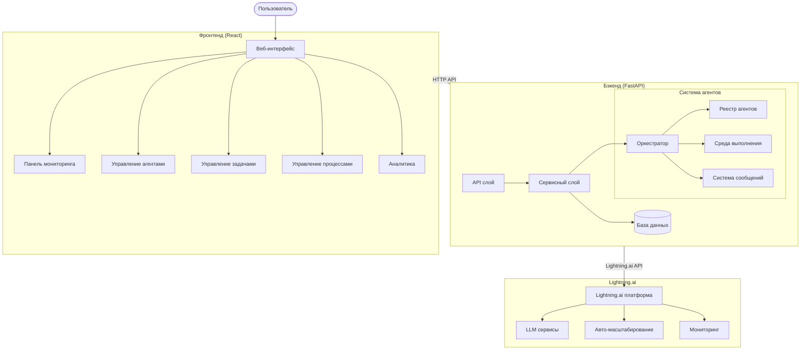
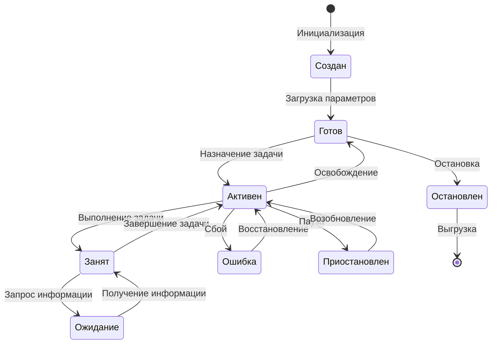
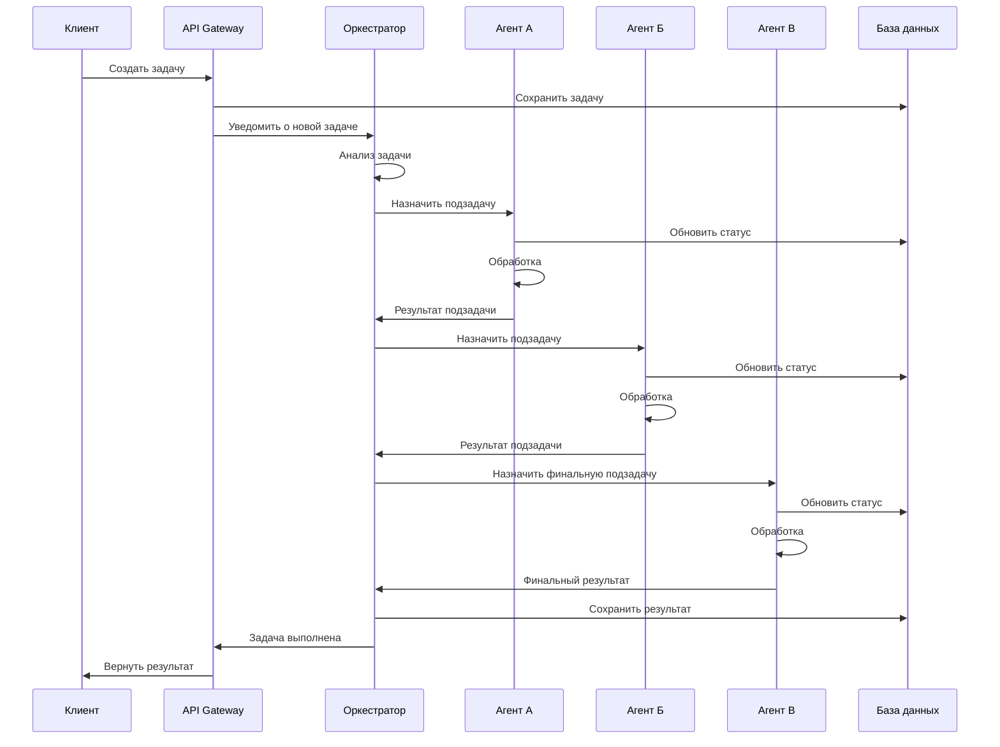
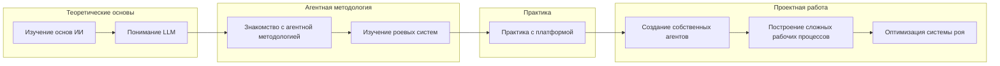
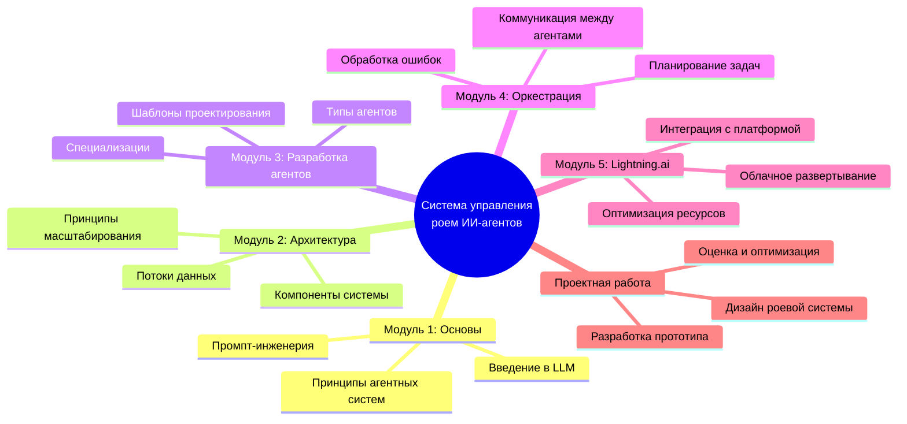

# 🧠 Система управления роем ИИ-агентов

<div align="center">


[](https://www.python.org)
[](https://fastapi.tiangolo.com/)
[](https://reactjs.org/)
[](https://docs.pydantic.dev/)
[](https://lightning.ai/)
[](LICENSE)
[](/)

**Интуитивно понятная платформа для управления, координации и оркестрации множества ИИ-агентов в мощную систему роевого интеллекта**

[English Version](README.md) • [Основные функции](#основные-функции) • [Установка](#установка) • [Быстрый старт](#быстрый-старт) • [Документация](#документация) • [Архитектура](#архитектура) • [Лицензия](#лицензия)

</div>

## 🌟 Основные функции

<table>
  <tr>
    <td width="50%">
      <h3>🤖 Управление агентами</h3>
      <ul>
        <li>Создание, настройка и управление специализированными ИИ-агентами</li>
        <li>Мониторинг статуса и производительности агентов в реальном времени</li>
        <li>Расширяемые шаблоны агентов для типовых ролей</li>
      </ul>
    </td>
    <td width="50%">
      <h3>🔄 Динамическая оркестрация</h3>
      <ul>
        <li>Координация сложных рабочих процессов между несколькими агентами</li>
        <li>Автоматическое распределение и приоритизация задач</li>
        <li>Интеллектуальная обработка ошибок и восстановление</li>
      </ul>
    </td>
  </tr>
  <tr>
    <td width="50%">
      <h3>📊 Визуализация и анализ</h3>
      <ul>
        <li>Интерактивные панели мониторинга системы</li>
        <li>Метрики производительности и аналитика</li>
        <li>Визуализация потока процессов</li>
      </ul>
    </td>
    <td width="50%">
      <h3>⚙️ Расширяемая архитектура</h3>
      <ul>
        <li>Модульный дизайн для простой настройки</li>
        <li>RESTful API для беспрепятственной интеграции</li>
        <li>Хорошо документированная кодовая база с моделями Pydantic</li>
      </ul>
    </td>
  </tr>
</table>

## 📸 Скриншоты

<div align="center">
  
  <p><em>Главная панель управления, показывающая статус агентов и производительность системы</em></p>
</div>

<div align="center">
  <table>
    <tr>
      <td></td>
      <td></td>
    </tr>
    <tr>
      <td align="center"><em>Интерфейс управления агентами</em></td>
      <td align="center"><em>Визуализация и мониторинг процессов</em></td>
    </tr>
  </table>
</div>

## 🚀 Установка

### Предварительные требования

- Python 3.10+
- Node.js 16+
- npm или yarn
- Аккаунт на платформе Lightning.ai

### Настройка бэкенда

```bash
# Клонирование репозитория
git clone https://github.com/yourusername/swarm-ai-system.git
cd swarm-ai-system

# Создание виртуального окружения
python -m venv venv
source venv/bin/activate  # На Windows: venv\Scripts\activate

# Установка зависимостей бэкенда
pip install -r requirements.txt

# Инициализация базы данных
python -m scripts.init_db
```

### Настройка фронтенда

```bash
# Переход в директорию фронтенда
cd frontend

# Установка зависимостей
npm install

# Сборка файлов для продакшена
npm run build
```

## ⚡ Быстрый старт

### Запуск сервера

```bash
# Из корня проекта
python main.py
```

Откройте `http://localhost:8000` для доступа к веб-интерфейсу.

### Документация API

FastAPI автоматически генерирует интерактивную документацию API:

- Swagger UI: `http://localhost:8000/api/docs`
- ReDoc: `http://localhost:8000/api/redoc`

## 🧩 Архитектура системы

### Диаграмма компонентов системы



> **Объяснение диаграммы:** 
> 
> Эта архитектурная диаграмма иллюстрирует полную структуру нашей платформы роевого интеллекта. Система состоит из трех основных уровней:
> 
> 1. **Фронтенд-уровень**: Пользовательский интерфейс на базе React, который предоставляет различные функциональные модули, включая панель мониторинга, управление агентами, управление задачами, оркестрацию процессов и визуализацию аналитики.
> 
> 2. **Бэкенд-уровень**: Построенный на FastAPI, этот уровень содержит основную бизнес-логику, включая API-шлюз для взаимодействия с клиентами, сервисный слой для бизнес-логики, движок оркестрации для координации агентов и взаимодействия с базой данных.
> 
> 3. **Интеграция с Lightning.ai**: Система использует платформу Lightning.ai для мощных возможностей машинного обучения, предоставляя сервисы LLM, автоматическое масштабирование ресурсов и инструменты мониторинга.
> 
> Центральным компонентом является Система агентов, которая включает Реестр агентов (для управления доступными типами агентов), Среду выполнения (где агенты выполняют свои задачи) и Систему сообщений (обеспечивающую коммуникацию между агентами). Все эти компоненты работают вместе для создания согласованной и надежной системы роевого интеллекта, способной решать сложные задачи через сотрудничество агентов.
> 
> Для углубленного объяснения см. [Руководство по архитектуре](docs/architecture/system_architecture.ru.md).

### Жизненный цикл агента



> **Объяснение диаграммы:**
> 
> Эта диаграмма состояний отображает полный жизненный цикл ИИ-агента в нашей роевой системе:
> 
> 1. **Фаза создания**: Агент инициализируется с базовой конфигурацией и переходит в состояние "Создан".
> 
> 2. **Фаза подготовки**: Агент загружает все необходимые параметры, модели и инструменты, затем переходит в состояние "Готов", ожидая задач.
> 
> 3. **Активная фаза**: При назначении задачи агент переходит в состояние "Активен", затем в "Занят" при выполнении.
> 
> 4. **Фаза взаимодействия**: В процессе выполнения задачи агент может запрашивать информацию (состояние "Ожидание") у других агентов или внешних источников.
> 
> 5. **Фаза завершения**: После выполнения задачи агент возвращается в состояние "Активен", затем в "Готов" при освобождении от задачи.
> 
> 6. **Обработка ошибок**: При возникновении сбоев агент переходит в состояние "Ошибка" и пытается выполнить процедуры восстановления.
> 
> 7. **Состояния управления**: Администраторы могут приостанавливать и возобновлять работу агентов по мере необходимости для обслуживания системы.
> 
> 8. **Завершение**: Когда агент больше не нужен, он останавливается и в конечном итоге выгружается из системы.
> 
> Понимание этого жизненного цикла крайне важно для эффективного управления агентами и устранения неполадок. Каждый переход запускает определенные события и логирование в системе.
> 
> Подробности реализации см. в [Документации по жизненному циклу агентов](docs/agents/agent_lifecycle.ru.md).

### Последовательность обработки задачи



> **Объяснение диаграммы:**
> 
> Эта диаграмма последовательности иллюстрирует полный поток задачи через нашу систему роевого интеллекта:
> 
> 1. **Создание задачи**: Клиент отправляет задачу через API-шлюз, который сохраняет её в базе данных и уведомляет Оркестратор.
> 
> 2. **Анализ и планирование задачи**: Оркестратор анализирует задачу и разрабатывает стратегию выполнения, разбивая её на подзадачи.
> 
> 3. **Назначение агентов и выполнение**: Подзадачи назначаются специализированным агентам (Агент А, Агент Б, Агент В) на основе их возможностей и текущей нагрузки.
> 
> 4. **Прогрессивная обработка**: Каждый агент обрабатывает назначенную ему подзадачу, обновляет свой статус в базе данных и возвращает результаты Оркестратору.
> 
> 5. **Координация и управление зависимостями**: Оркестратор координирует последовательность действий агентов, обеспечивая получение ими необходимых входных данных от предыдущих операций.
> 
> 6. **Компиляция результатов**: После выполнения всех подзадач Оркестратор компилирует окончательный результат, сохраняет его в базе данных и возвращает клиенту.
> 
> Этот рабочий процесс демонстрирует способность системы декомпозировать сложные проблемы на управляемые подзадачи, распределять их между специализированными агентами и объединять результаты в согласованное решение.
> 
> Практические примеры реализации см. в [Руководстве по обработке задач](docs/tutorials/task_processing.ru.md).

### Образовательный путь



> **Объяснение диаграммы:**
> 
> Эта диаграмма образовательного пути описывает рекомендуемую последовательность обучения для освоения систем роевого ИИ:
> 
> 1. **Теоретические основы**: Начните с основ ИИ для понимания базовых концепций, затем перейдите к концепциям LLM (больших языковых моделей) для понимания ключевой технологии, на которой работают современные ИИ-агенты.
> 
> 2. **Агентная методология**: Продолжите изучение методологии агентов, чтобы понять, как функционируют отдельные ИИ-агенты, затем изучите принципы роевого интеллекта, которые обеспечивают эффективное сотрудничество между несколькими агентами.
> 
> 3. **Практический опыт**: Примените теоретические знания через практические упражнения на нашей платформе.
> 
> 4. **Проектная работа**: Перейдите к созданию пользовательских агентов, адаптированных для конкретных задач, проектированию сложных рабочих процессов, координирующих нескольких агентов, и оптимизации производительности роя.
> 
> Этот структурированный путь обучения обеспечивает всестороннее понимание как теоретических принципов, так и практических приложений, позволяя учащимся перейти от базовых концепций к продвинутому проектированию систем.
> 
> Наша документация включает полные учебные пособия для каждой фазы. Начните с [Руководства по образовательному пути](docs/education/learning_path.ru.md).

### Структура образовательного курса



> **Объяснение диаграммы:**
> 
> Эта ментальная карта представляет структуру образовательного курса по роевым ИИ-системам:
> 
> 1. **Модуль 1: Основы** закладывает фундаментальные знания о современных ИИ-технологиях:
>    - Введение в принципы работы больших языковых моделей (LLM)
>    - Основные концепции агентных систем и их преимущества
>    - Базовые навыки промпт-инженерии для эффективного взаимодействия с LLM
>
> 2. **Модуль 2: Архитектура** фокусируется на структуре роевых систем:
>    - Детальный разбор компонентов системы и их взаимодействия
>    - Анализ потоков данных между агентами и внешними системами
>    - Изучение принципов масштабирования для поддержки растущей нагрузки
>
> 3. **Модуль 3: Разработка агентов** углубляется в создание индивидуальных агентов:
>    - Классификация и применение различных типов агентов
>    - Создание специализированных агентов для конкретных задач
>    - Использование эффективных шаблонов проектирования
>
> 4. **Модуль 4: Оркестрация** охватывает координацию множества агентов:
>    - Реализация протоколов коммуникации между агентами
>    - Стратегии эффективного планирования и распределения задач
>    - Механизмы обработки ошибок и восстановления
>
> 5. **Модуль 5: Lightning.ai** посвящен практической интеграции с платформой:
>    - Методы интеграции с сервисами Lightning.ai
>    - Развертывание роевых систем в облачной среде
>    - Оптимизация использования вычислительных ресурсов
>
> Курс завершается **Проектной работой**, где участники применяют полученные знания для разработки полноценной роевой системы от концепции до реализации и оптимизации.
>
> Подробную программу каждого модуля можно найти в [документации курса](docs/education/course_structure.ru.md).

        
        subgraph AgentSystem["Система агентов"]
            Orchestrator --> AgentRegistry[Реестр агентов]
            Orchestrator --> AgentRuntime[Среда выполнения]
            Orchestrator --> MessageQueue[Система сообщений]
        end
    end
    
    Backend --Lightning.ai API--> LightningPlatform[Lightning.ai платформа]
    
    subgraph LightningAI["Lightning.ai"]
        LightningPlatform --> LLMServices[LLM сервисы]
        LightningPlatform --> Scaling[Авто-масштабирование]
        LightningPlatform --> Monitoring[Мониторинг]
    end
```

### Жизненный цикл агента


### Последовательность обработки задачи


## 📋 Примеры использования

### Создание простого роя агентов

```python
from swarm_ai.models import Agent, AgentType
from swarm_ai.agent_utils import AgentRegistry
import lightning.app as lightning  # Интеграция с Lightning.ai

# Создание специализированных агентов
researcher = AgentRegistry.get_agent_by_type(AgentType.RESEARCHER)
analyzer = AgentRegistry.get_agent_by_type(AgentType.ANALYZER)
writer = AgentRegistry.get_agent_by_type(AgentType.WRITER)

# Настройка и кастомизация
researcher.name = "ИсследовательАгент"
researcher.system_prompt = "Ваша кастомная инструкция для агента..."

# Создание компонента Lightning.ai для агента
class AgentComponent(lightning.LightningWork):
    def __init__(self, agent_config):
        super().__init__()
        self.agent_config = agent_config
        
    def run(self):
        # Инициализация агента в среде Lightning.ai
        # и подключение к системной шине сообщений
        pass

# Интеграция с Lightning
app = lightning.LightningApp(
    AgentComponent(researcher.dict()),
    AgentComponent(analyzer.dict()),
    AgentComponent(writer.dict())
)

# Создание процесса, связывающего агентов
process_config = {
    "name": "Создание контента",
    "agents": [researcher.id, analyzer.id, writer.id],
    "steps": [
        # Конфигурация шагов процесса
    ]
}

api_client.create_process(process_config)
```

## 📈 Метрики производительности

<div align="center">
  <table>
    <tr>
      <th>Конфигурация</th>
      <th>Агенты</th>
      <th>Задач в минуту</th>
      <th>Время отклика</th>
      <th>Использование ресурсов</th>
    </tr>
    <tr>
      <td>Базовая</td>
      <td>3-5</td>
      <td>30-50</td>
      <td>~500мс</td>
      <td>Низкое</td>
    </tr>
    <tr>
      <td>Продвинутая</td>
      <td>10-15</td>
      <td>100-150</td>
      <td>~800мс</td>
      <td>Среднее</td>
    </tr>
    <tr>
      <td>Корпоративная</td>
      <td>20+</td>
      <td>200+</td>
      <td>~1200мс</td>
      <td>Высокое</td>
    </tr>
  </table>
</div>

## 🧪 Тестирование

```bash
# Запуск тестов
pytest tests/

# Запуск с отчетом о покрытии
pytest --cov=swarm_ai tests/
```

## 🤝 Вклад в проект

Ваш вклад приветствуется! Пожалуйста, не стесняйтесь отправлять Pull Request.

1. Форкните репозиторий
2. Создайте ветку для вашей функции (`git checkout -b feature/amazing-feature`)
3. Зафиксируйте ваши изменения (`git commit -m 'Add some amazing feature'`)
4. Отправьте изменения в ветку (`git push origin feature/amazing-feature`)
5. Откройте Pull Request

Пожалуйста, убедитесь, что ваш код соответствует стилю кодирования проекта и проходит все тесты.

## 📚 Документация

- [Полная документация](https://swarm-ai-docs.example.com)
- [Справочник API](https://swarm-ai-docs.example.com/api)
- [Руководство по архитектуре](https://swarm-ai-docs.example.com/architecture)
- [Учебник: Создание вашего первого роя](https://swarm-ai-docs.example.com/tutorials/first-swarm)

## 📊 Статус проекта

Этот проект в настоящее время находится в фазе **прототипа**. Основная функциональность реализована, но система активно разрабатывается и может претерпеть значительные изменения.

## 🎓 Образовательные материалы

### Диаграмма образовательного процесса


### Структура образовательного курса


## 📜 Лицензия

Этот проект лицензирован под лицензией MIT - см. файл [LICENSE](LICENSE) для подробностей.

## 🙏 Благодарности

- [FastAPI](https://fastapi.tiangolo.com/) за высокопроизводительный API фреймворк
- [Pydantic](https://docs.pydantic.dev/) за валидацию данных и управление настройками
- [React](https://reactjs.org/) за библиотеку UI фронтенда
- [SQLAlchemy](https://www.sqlalchemy.org/) за ORM базы данных
- [Recharts](https://recharts.org/) за компоненты визуализации
- [Lightning.ai](https://lightning.ai/) за платформу для разработки и масштабирования ИИ-систем

---

<div align="center">
  
  <p>
    <a href="https://github.com/yourusername/swarm-ai-system/issues">Сообщить о проблеме</a> •
    <a href="https://github.com/yourusername/swarm-ai-system/issues">Запросить функцию</a> •
    <a href="https://twitter.com/your-twitter">Twitter</a> •
    <a href="https://discord.gg/your-discord">Discord</a>
  </p>
  <p>Сделано с ❤️ Вашей командой</p>
</div>